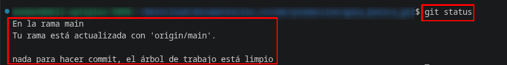

# 🚀 Guía básica Git para GitHub
[](https://miquelnebot.eu)
[](LICENSE)
[](https://raw.githubusercontent.com/miquelnebotaragon/guia_basica_git/refs/heads/main/README.md)

## ⛏️ 1. Crear repositorio local y subirlo a GitHub
### 📦 Flujo de trabajo

0. Antes de empezar
Git no crea por ti el repositorio remoto en GitHub. Deberás entonces abrir tu cuenta y crear manualmente tu repositorio sin README, License, .gitignore... Necesitamos un repositorio vacío.

1. Configuración inicial

Antes de empezar, Git necesita saber quién eres para firmar tus avances.

❗ Atención: Solo será necesario realizar este paso la primera vez.
```bash
git config --global user.name "Tu nombre" # No es el nombre de usuario, es un nombre descriptivo para firmar los "commit". Por ejemplo: "Miquel hizo este cambio"
git config --global user.email "tu@email.es"
```
2. Inicializamos el repositorio de Git en nuestro equipo local
```bash
git init
```
➡️ De esta manera arranca el control de versiones en la carpeta de nuestro proyecto.

❗ Atención: De manera predeterminada y sin que sea necesaria intervención alguna por nuestra parte, se creará una carpeta oculta de nombre ".git" que será la que contendrá todo lo necesario para sincronizar con el repositorio remoto. ¡No la edites manualmente ni la borres!  

3. Añadir archivos al repositorio
```bash
git add .
```
➡️ En este comando, el argumento punto (.) indica que quieres incluir todos los cambios del directorio actual.

➕ Tip: Usa `git status` antes de este paso para ver qué archivos están modificados.

4. Confirmar los cambios (crear *commit*)
```bash
git commit -m "Comentario para identificar la primera subida, por ejemplo Subida inicial"
```
➡️ Crea una "fotografía" o estado permanente de tu proyecto en ese momento exacto.

5. Renombrar la rama de trabajo principal
```bash
git branch -M main
```
➡️ GitHub utiliza por defecto el nombre "main". Este comando asegura que tu rama local se llame igual (antiguamente se usaba "master").

6. Vincular con GitHub (remoto)
```bash
git remote add origin https://github.com/usuario/nombre_del_repo.git
```
❗ Atención: Antes de ejecutar este paso, debes haber creado el repositorio en la web de GitHub (vacío, sin README ni licencia) para obtener la correspondiente URL que utilizaremos en este paso.

➡️ Estableces el puente entre tu PC y el servidor. El nombre "origin" es el estándar para referirse al servidor principal.

7. Subir el repositorio
```bash
git push -u origin main
```
➡️ El parámetro -u (*upstream*) vincula tu rama local con la remota y crea un vínculo permanente. Así pues, en las próximas subidas, solo necesitarás escribir `git push`.

## 🧩 Resumen
```bash
git init
git add .
git commit -m "Carga inicial de archivos"
git branch -M main
git remote add origin https://github.com/miquelnebotaragon/mi_primer_repo.git # Solicitará loguearse en GitHub
git push -u origin main
```

## 📤 2. Sesiones futuras. Subir un único archivo modificado
### 📦 Flujo de trabajo
1. Ver los cambios pendientes
```bash
git status
```
➡️ Identifica los archivos modificados.



2. Añadir uno o varios archivos que hayan sufrido cambios en local
```bash
git add archivo1.md archivo2.md
```

3. Crear el "commit" correspondiente
```bash
git commit -m "Mejoras programadas"
```

4. Subir los archivos a GitHub
```bash
git push
```

## 🧩 Resumen
```bash
git add archivo
git commit -m "Carga de archivo modificado"
git push
```

## ⚙️ 3. Trabajar con clientes de sincronización de archivos
### 📦 Flujo de trabajo
¿Es posible utilizar Nextcloud, Drive, Dropbox... para sincronizar mis repositorios Git locales? Respuesta corta, sí pero veamos por partes si es recomendable o no.

#### ☁️ ¿Qué ocurre con .git?
* El directorio oculto ".git" contiene TODO el repositorio
* Cuando el cliente de sincronización de ficheros actúa (por ejemplo Nextcloud Desktop), se sincroniza todo el contenido del directorio como cualquier carpeta visible u oculta
* Mantiene la configuración y la conexión con GitHub

Por lo tanto...
#### 💻 En otro de mis ordenadores, ¿qué ocurre?
* No necesitas `git init`, ya está hecho y disponible en la carpeta oculta ".git"
* Puedes trabajar directamente con:
    ```bash
    git status
    git add archivo
    git commit -m "Cambios hechos en mi segundo equipo"
    git push
    ```
#### 🤔 Entonces, ¿es recomendable este flujo de trabajo?
A efectos prácticos, si se tiene cuidado con algunas características de estos clientes de sincronización, sí que podemos usarlo, pero no es recomendable por los problemas que a continuación se muestran.
* ❌ Se pueden dar problemas de sincronización,
* ❌ que desencadenarán la corrupción del repositorio
* ✅ Mejor que usar clientes de sincronización, utilizar GitHub como repositorio. Con un `git pull` descargaremos todos los archivos del directorio remoto a nuestro equipo.
* 🥇 Regla de oro: Antes de tocar nada, `git pull` para descargar los cambios del servidor.
    ```bash
    git pull    # 1. Trae lo último de GitHub a tu PC
    git add .   # 2. Prepara tus nuevos cambios
    git commit -m "Cambios" # 3. "Fotografía" del proyecto en este estado
    git push    # 4. Sube todo lo actualizado
    ```